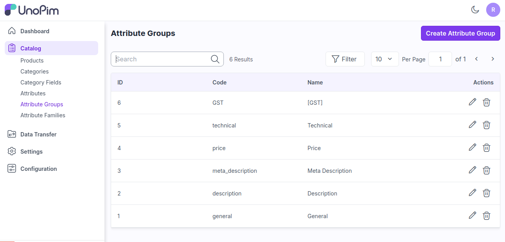
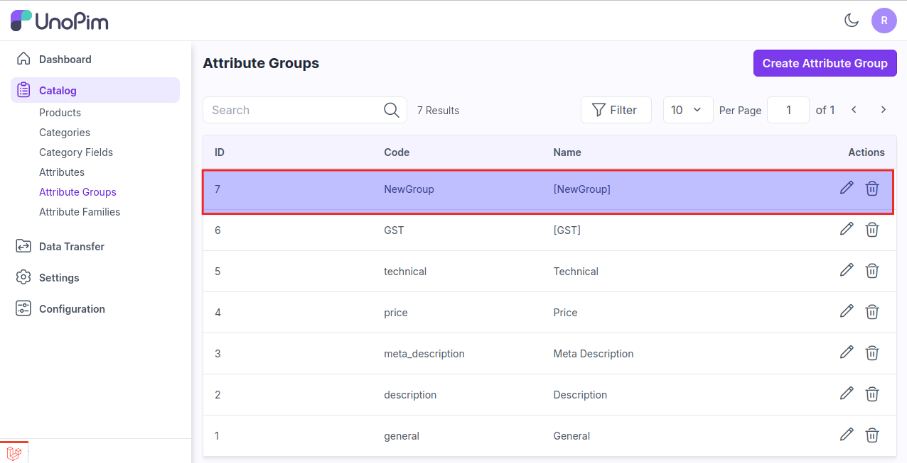
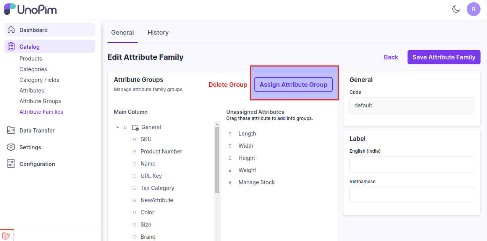
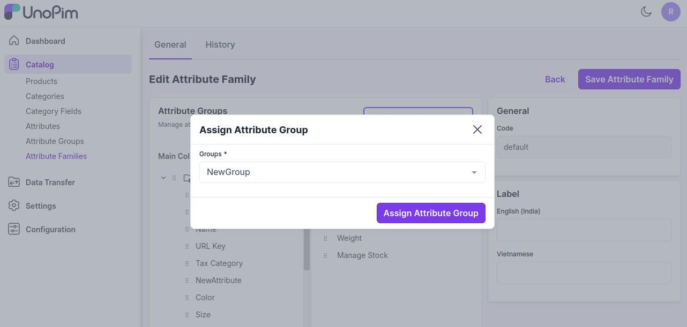

# Attribute Groups 

Attribute groups are used to Gather attributes together to give more visibility when users fill in values

Organize the work of the different contributors on products.

### Steps to Create Attribute Groups in UnoPim

**Step 1-**  On the Admin Dashboard, click **Catalog** >> **Attribute Groups** >> **Create Attribute Groups** as shown below.

 

**Step 2-** Now add the **Code** & **Label** of the group and then click on **Save Attribute Group** as shown in the below image.

 

So now a **New Attribute Group** is created as shown in the below image.

 

**Step 3-** Now to assign this group click on **Catalog >> Attribute Families >> Edit Default Attribute Family** and click on **Assign Attribute Group** as shown in the image below.

 

**Step 4-** Now select the group and click on **Assign Attribute Group** button as shown below.

 

New group is created successfully in the main content. 

 

On the Admin Dashboard, click **Catalog >> Products >> Create Product**.

Now the group will appear automatically in your product form. If the product has at least one attribute in this group.

 

