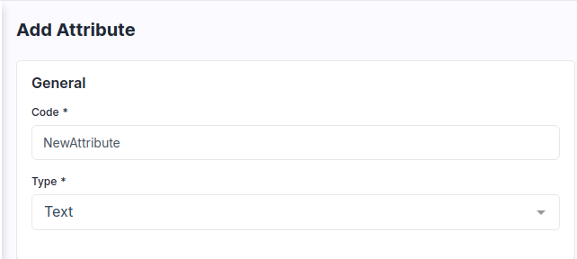
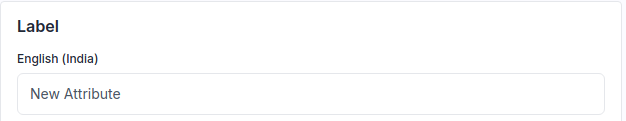
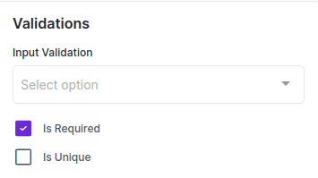
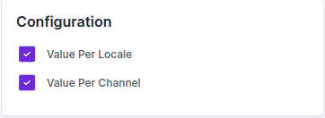

# Create Product Attribute

An Attribute is a specification or characteristic of a product for example Color, Size, and Pattern an attribute of a T-Shirt. You can as create many attributes for a single product. Product Attribute plays a major factor in the buying decision of the Customer.

### How to Create a Product Attribute in UnoPim

To Create UnoPim Attributes, open the Admin Panel and then follow the below step

### Add Attributes

1) Click on **Catalog** >> **Attributes** >> **Create Attributes** as shown in the below image.

 

2) Now enter the **Code** and **Data Type** inside the general section.

   

3) Enter the Label of your Attribute as shown in the below image.

   

4) Select the Validation if you want to make your Attribute as a required field.

   

5) Select the field if you want to make the Attribute value as per the locale and value as per the channel.

      

Now, click on **Save Attribute** button and then the attribute is created successfully in the Datagrid.

      

Now **Save the Attribute** and then go the the Attribute Family from **Catalog >> Attribute Families** and assign it from the unassigned attribute by drag and drop at your desired place as shown in the below image.

      

Now, **Save Attribute Family** and check the output while creating products on the product edit page as shown in the below image.   

      

By following the above steps, you can easily create a **Product Attribute** in UnoPim.

