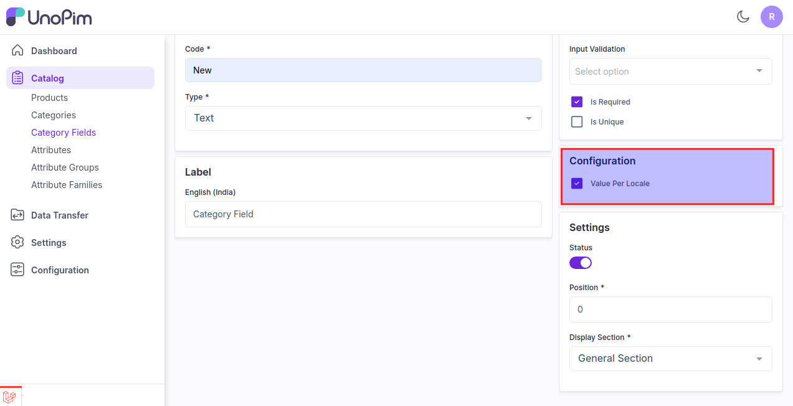

# Category Fields 

Category Fields are similar to attributes for products, whereas category fields are used in categories. 

Category fields generally refer to specific attributes or types of information used to classify or organize items.

### Steps to Create a Category Fields in UnoPim

1) Click on **Catalog >> Category Field >> Click Category Field** button  as shown in the below image.

   

2) Now enter the **Code** and **Type** inside the general section.

### In UnoPim by default there are 10 Types

**1) Text** - A field that allows the user to enter a single line of text. It is typically used for short inputs like names, email addresses, or search queries.

**2) Textarea** - A field that provides a larger area for users to input multi-line text. It’s useful for longer responses or comments, such as descriptions or messages.

**3) Boolean** - Represents a true or false value. It's often used in forms to capture yes/no or on/off selections.

**4) Select** - A dropdown menu that allows users to choose one option from a list. It’s useful for making selections where only one option should be chosen from a predefined set of options.

**5) Multiselect** - Similar to a select field but allows users to choose multiple options from a list. It’s useful when multiple selections are valid and necessary.

**6) Datetime** - A field that allows users to select a specific date and time. It’s often used for scheduling or timestamping events.

**7) Date** - A field that allows users to select or input a date only (without time). It’s used for choosing a specific day in forms and calendars.

**8) Image** - A field for uploading or displaying images. Users can either upload an image file or view an image that’s already been uploaded.

**9) File** - A field that allows users to upload files. It can accept various file types, such as documents, images, or other file formats.

**10) Checkbox** - A small box that can be checked or unchecked. It’s used for binary choices, where a user can select or deselect an option, often used for agreements or preferences.
 
**Note -** The **Is Unique** Validation is only available for Type - **Text, Datetime & Date**

   

3) Enter the Label of your category field as shown in the below image.

   

4) Select the Validation if you want to make your category field as a required field.

   

5) Select the field if you want to make the category field value as per the locale.

This allows you to manage the category field for different locale in the category.

   

6) Now in the settings option enable the **status** of the field enter the **position** of your field at where you want to place this field as a sort order while creating a category and then select the display section as a general section or configurable section. 

   

At Last click on **Save Category Field** button and the new category field is created successfully as shown in the image below.

   

Now go to **Catalog >> Categories >> Create Category** and you are able to see the **New Category Field** while creating or updating category.

   

