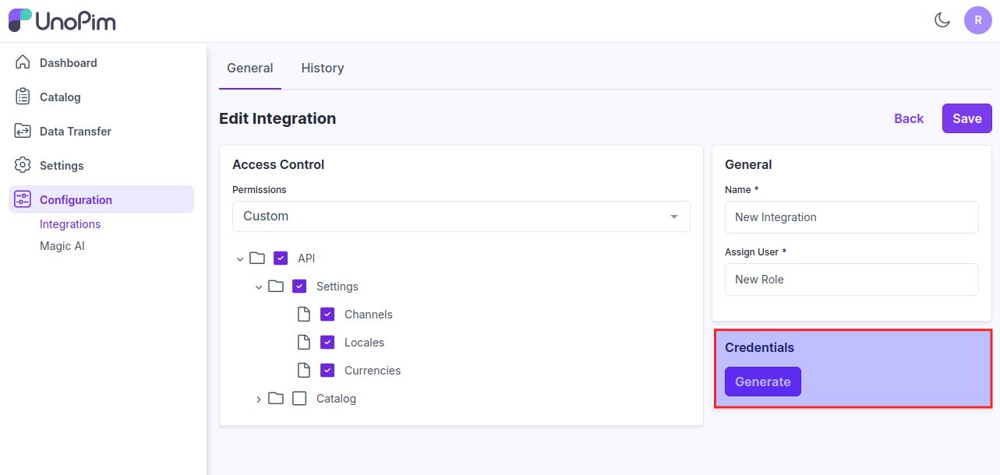
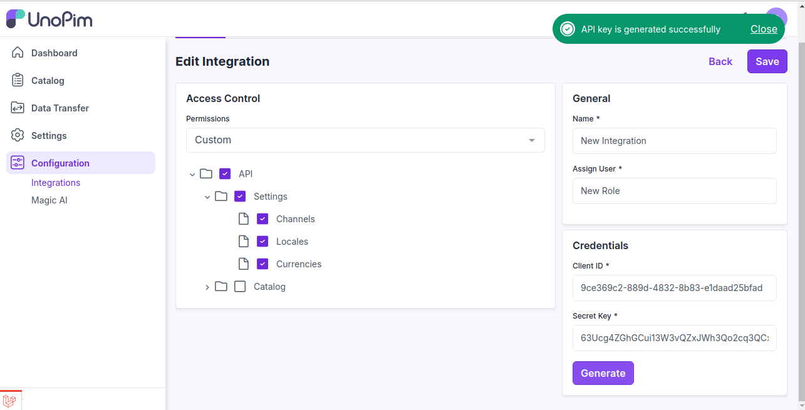
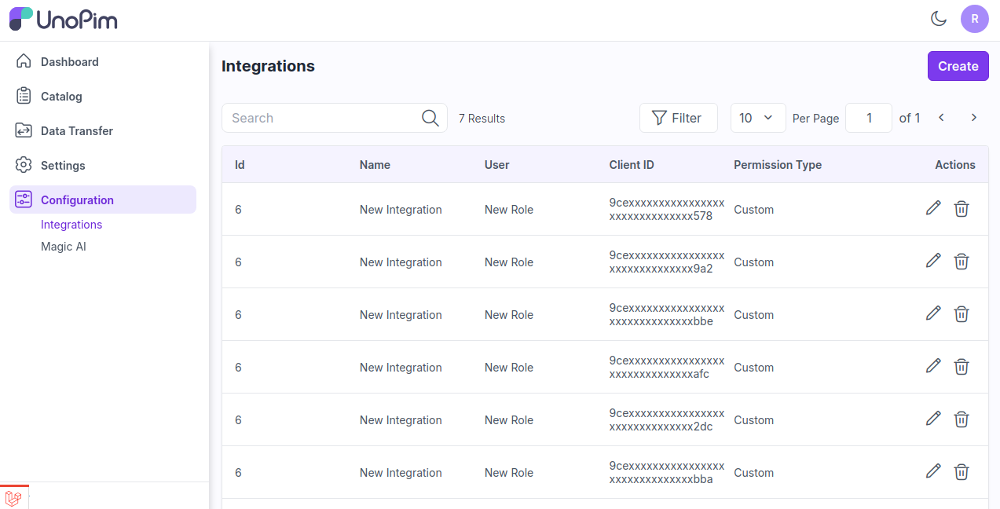

# Integration 

Integration in UnoPim is crucial for ensuring that product data is consistent, accurate, and easily accessible across various systems and channels. 

### Steps of Integration in UnoPim

**Step 1-** Go to the Admin panel of UnoPim click on **Configurations >> Integration** and click on **Create**  button.

   

**Step 2:** Add the below fields.

1) **Permissions:** Select the permission from the options **Custom & All**.

* **Custom-** Select the custom option if you need to show the menus as per your requirements. 

* **All-** Select the all option if you need to show all the menus.

2) **Name-** Enter the name of the Integration.

3) **Assign User-** Assign the user for the Integration.

   

**Step 3-** Now the option will get visible to generate the credentials as shown below.

   

**Step 4-** Now click on **Generate** button to generate API Keys.

   

**Step 5-** Now the Integration is created successfully for the assigned user in the Datagrid as shown in the image below.

   

So by this you can easily create your integration of API in UnoPim.