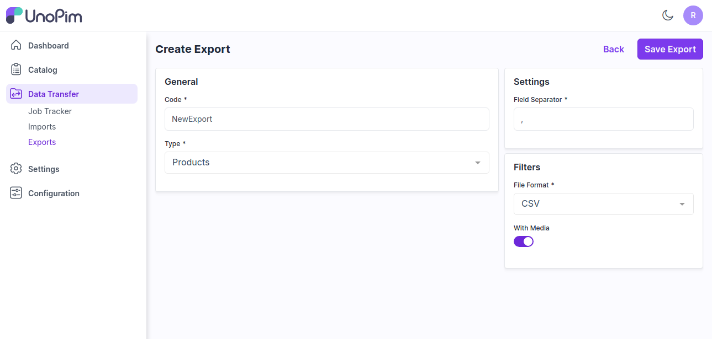
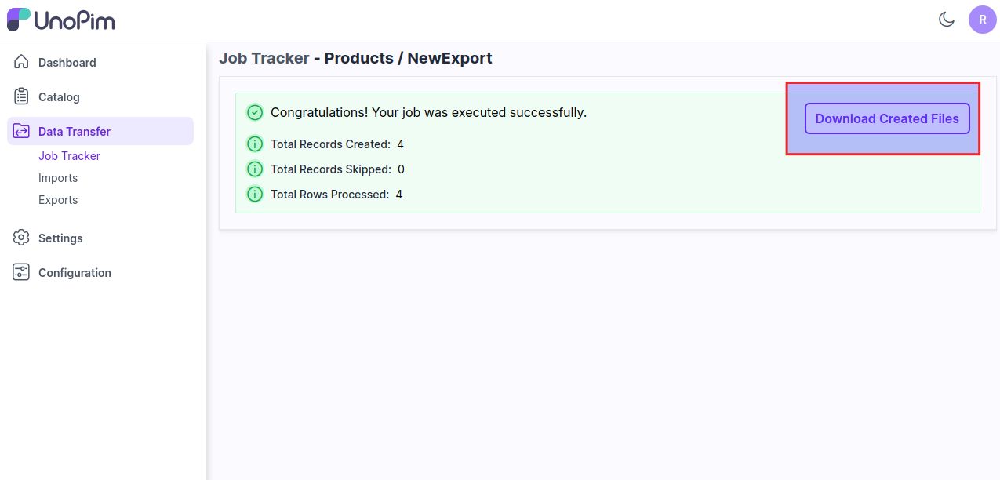

# Export 

Exporting data to save information in files is a common practice for data management, analysis, and sharing. This involves transferring data from a source system into a file format that is suitable for storage, future use, or sharing with others. 

### Steps to add Bulk Export in UnoPim

**Step 1:** Go to the Admin panel of UnoPim click on **Data Transfer >> Exports** and click on Create Exports button.

   

**Step 2:** Under general configurations add the below fields.

1) **Code -** Enter the code of your Export process.

2) **Type -** Kindly select the type i.e. (Products, Categories) which you want to Export.

3) **Field Separator –** This feature allows you to set the fields. 

4) **Filters -** Select the format of the file **(CSV, XLS, XLSX)** as per your requiremnts from the dropdown.

5) **With Media -** Enable or Disable if you need the export data with or without Media. 

Now, click on **Save Export** button

   

**Step 3:** Now click on **Export Now** button as shown in the below image.

   

**Step 4:** Now click on **Data Transfer >> Job Tracker** where you see the status of your export process. After the status got completed then the export process is been done successfully.

Also you can run the below command in the root of your UnoPim.

**php artisan queue:listen**

Now click on action to view you export data as shown in the below image.

   

**Step 5:** You can easily download your export file from here.

   

So by the above steps you can easily create Export Data in UnoPim.   

