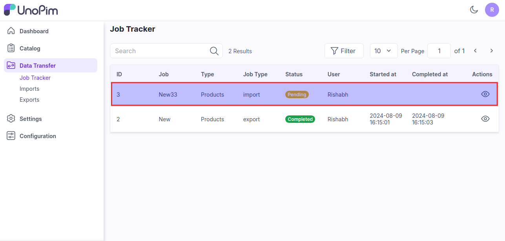

# Import

Bulk import is a feature that allows users to import large quantities of data into a system quickly and efficiently. It simplifies the process and saves time by not having to add each piece of information one by one.

The feature works differently for each system and has a vast variety of use cases across many industries as well as [UnoPim](https://unopim.com/).

### Steps to add Bulk Import in UnoPim

**Step 1:** Go to the Admin panel of UnoPim click on Data Transfer >> Imports and click on Create Import button.

   

**Step 2:** Under general configurations add the below fields:

1) **Code -** Enter the code of your Import process.

2) **Type -** Kindly select the type i.e. (Products, Categories) which you want to import.

3) **File –** Choose the file in your desired format (CSV, XLS, XLSX) and kindly make sure you have all the required fields in the file.

4) **Download Sample –** You can also download the sample files of types (Products, Categories). Kindly make sure the file you are uploading is similar to this sample file.

5) **Image Directory Path –** Use relative path to /project-root/storage/import/app, e.g. product-images, import-images.

6) **Action –** Kindly select from the settings configuration that you want to Create/Update or Delete the records.

7) **Validation Strategy –** This unique feature allows you to Skip the Errors or to Stop on Errors while Importing the data.

8) **Allowed Errors –** This feature allows you how much quantity of errors will get neglected while importing the data.

9) **Field Separator –** This feature allows you to set the fields. Now, click on **Save Import** button. 

   

**Step 3:** Now click on **Import Now** button as shown in the below image.

   

**Step 4:** Now click on **Data Transfer >> Job Tracker** where you see the status of your import process. After the status got completed then the import process is been done successfully.

Also you can run the below command in the root of your UnoPim.

**php artisan queue:listen**

   

So by the above steps you can easily create Import Data in UnoPim.