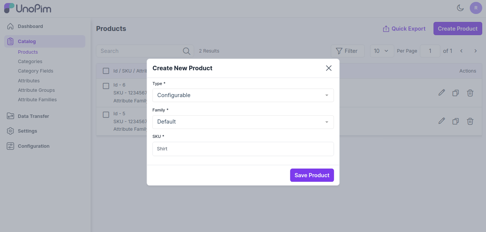
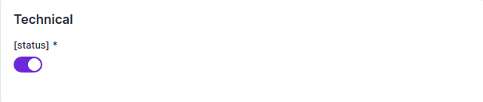
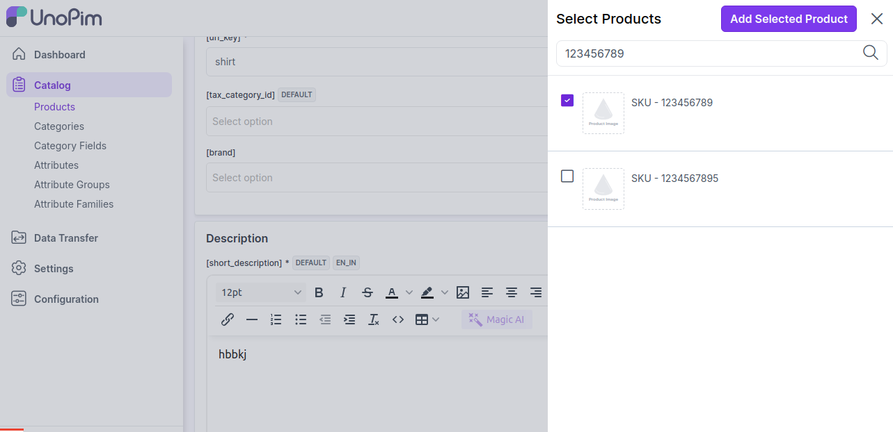
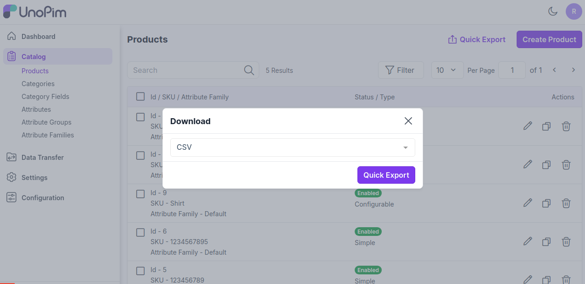
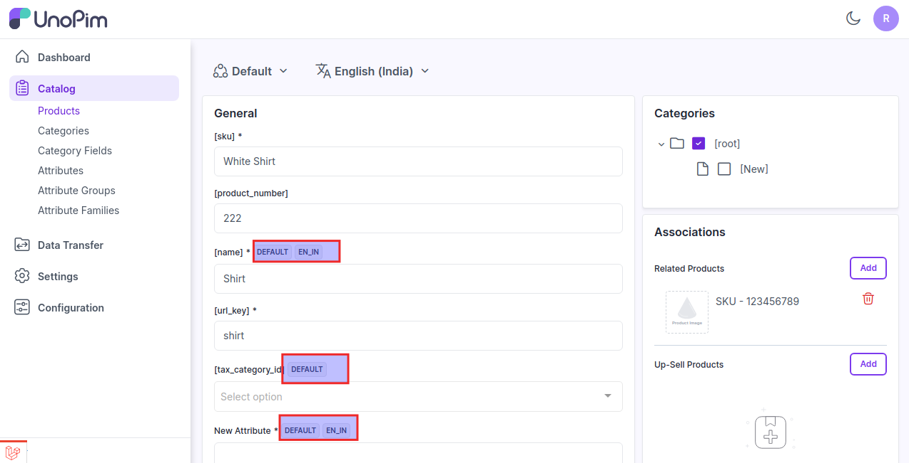

# Configurable Product

It refers to a type of product that offers various options or variations, such as size, color, or features, which can be selected by the customer. The PIM system manages these options and their associated attributes, ensuring accurate and comprehensive product information across different configurations.

Configurable products are designed to meet individual needs, enhancing customer satisfaction and providing a tailored experience in [UnoPim](https://unopim.com/).

### Create Configurable Product in UnoPim

1. Click on **Catalog >> Products >>** select **Configurable** , **Family** and enter **SKU** under Product Type .

  

Now click on **Save the Product**, and now select the **configurable attributes** as per your requirements, and then click on **Save Product** button as shown in the image below.

  

### General Attributes

It displays the attributes assigned in the product's family grouped by attribute group. 

The below given are required attributes present in the "default" family

1) Enter **SKU** of the product

2) Enter **Name** of the product

3) Now enter the **URL Key** of the product

 

### Short Description
Enter a short description of the features of the product.

### Description
Mention your product in detail.

  

### Technical

Now Enable the product from the status option as shown below.

  

### Categories

You can also assign the product into the root category as shown in the below image.

  

### Variations

Now enter the variations of the product for this click on Add Product as shown in the below image.

  

Now add the variant enter the configurable attributes and then click on **Add button** as shown in the image below.

  

You can add as many variants as per the requirements of the product.

### Associations

Also, you can add the Related Products, Upsell Products, and Cross-Sell Products.

**1) Related Products -** Related products are products that are similar to a selected product. You can display potential substitutes help to them discover other similar products they might like. 

To add Related Products click on Add in the Related Products section and search the product through the SKU which you want to add as a Related Product as shown in the image below. 

  

Now click on **Add Selected Product** button.

**2) Up-Sell Products -** Upselling is the practice of selling a higher-end version of an item they're interested in.

For instance, an electronics retailer pointing out the benefits of a better TV, a faster laptop, or a more durable tablet would be an example of upselling.

To add Up-Sell Products click on add in the Up-Sell Products section and search the product through the SKU which you want to add as a Up-Sell Product as shown in the image below. 

  

Now click on **Add Selected Product** button.

**2) Cross-Sell Products -** Cross-sells are products that you promote, based on the current product. They are typically complementary items. For example, if you are selling a laptop, cross-sells might be protective case stickers or a special adapter.

To add Cross-Sell Products click on add in the Cross-Sell Products section and search the product through SKU which you want to add as a Cross-Sell Product as shown in the image below. 

  

Now click on **Add Selected Product** button.

You can also add as many products as per your requirements.

At last, **Save the Product**.

  

Now the product has been created successfully and will be visible in the Products Data Grid as shown in the image below.

  

Additionally, you can also view the product history by navigating to **Catalog >> Products >> Edit Product** and clicking on **History** as shown below.

  

Afterwards, in the **Actions** you can view the product history as shown below.

  

Also, you can able to **Quick Export** your data into **CSV, XLS, XLSX** format.

  

Now, click on **Quick Export button** to export the data.

  

**Note-** Attributes that support values per channel will display a channel badge, while attributes that support values per locale will display a locale badge. If an attribute supports both values per channel and values per locale, it will display both badges.

  