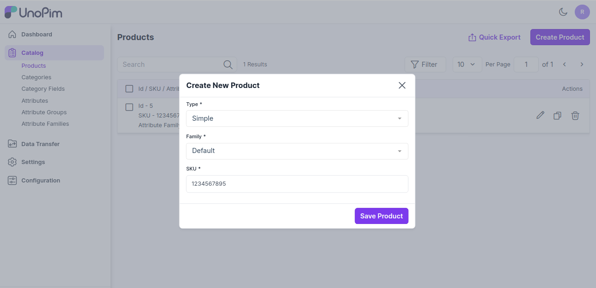
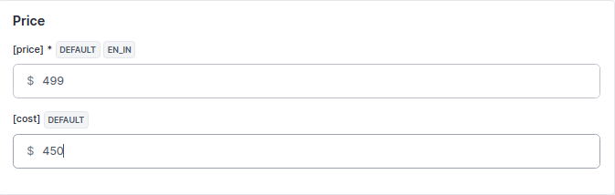

# Simple Product

A **simple product** is a product type in e-commerce that does not require customers to choose additional attributes (such as size or color) to add to the cart. It should be a physical item and can be shipped to customers.

Therefore, any service, such as downloadable items, does not count as a simple product. This is the step-by-step tutorial on how to add a simple product in [UnoPim](https://unopim.com/).

### Create Simple Product in UnoPim
1. Click on **Catalog >> Products >>** select **Simple** **Family** and enter **SKU** under Product Type .

     

Now **Save the Product**, and you will get redirected to the Edit product page as shown below.

### General Attributes
Below is the list of fields you need to fill under General Attributes.

 

### Description
Below is the list of the fields you need to fill in regarding the product under description.

#### Short Description
Enter a short description of the feature of the product.

#### Description
Mention your product in detail.

  

### Meta Description
Below is the list of fields that you need to provide under the meta description to make your product easily searchable on search engines.

#### Meta Title
Provide the main title of the product by which your product will be known.

#### Meta Keyword
The meta keyword for the product needs to be provided to improve its searchability on the search engine for specific keywords.

#### Meta Description
Enter the description so that products can easily appear in search engine listings.

  

### Price
Insert the price and cost price of the product as shown in the below image

 

### Technical

Now Enable the product from the status option as shown below.

  

### Categories

You can also assign the product into the root category as shown in the below image.

  

### Associations

Also you can add the Related Products, Upsell Products, Cross Sell Products.

**1) Related Products -** Related products are products that are similar to a selected product. You can display potential substitutes to help customers discover other similar products they might like. These products should appear in a You might also like section on the product page.

To add Related Products click on add in the related products section and search the product through SKU which you wants to add as a Related Product as shown in the image below. 

  

Now click on **Add Selected Product** button.

**2) Up-Sell Products -** Upselling is the practice of selling a customer a higher-end version of an item they're interested in. For instance, an electronics retailer pointing out the benefits of a better TV, a faster laptop or a more durable tablet would be an example of upselling.

To add Up-Sell Products click on add in the Up-Sell Products section and search the product through SKU which you wants to add as a Up-Sell Product as shown in the image below. 

  

Now click on **Add Selected Product** button.

**2) Cross-Sell Products -** Cross-sells are products that you promote in the cart, based on the current product. They are typically complementary items. For example, if you are selling a laptop, cross-sells might be a protective case or stickers or a special adapter.

To add Cross-Sell Products click on add in the Cross-Sell Products section and search the product through SKU which you wants to add as a Cross-Sell Product as shown in the image below. 

  

Now click on **Add Selected Product** button.

You can also add as many products as you can as per your requirements.

At last, **Save the Product**.

  

Now the product is created successfully and it will get visible in **Products Data Grid** as shown in the below image.

   

