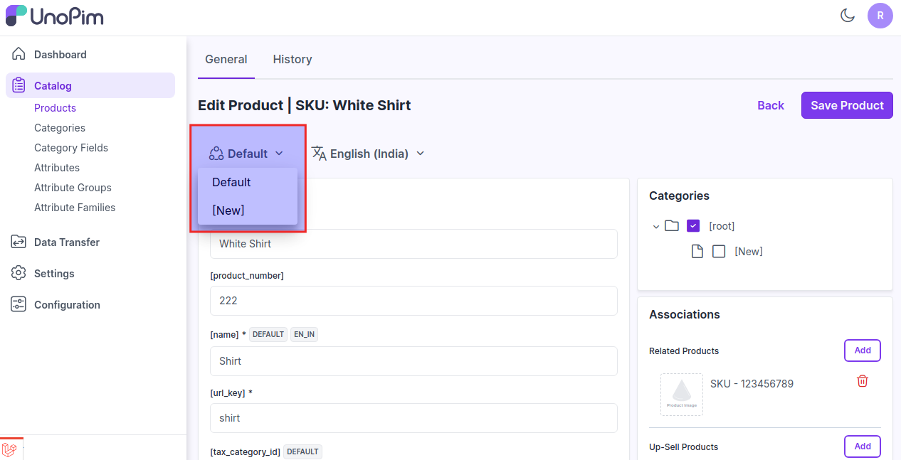

# Channels 

Channels help ensure that product information is accurately and consistently presented across different touchpoints and platforms.

### Creating Channels in UnoPim.

**Step 1:** The UnoPim's channel functionality allows the creating of multiple channels in UnoPim. Here you need to proceed towards **Settings >> Channels >> Create Channel** as shown in the below image.

 

### General

Below are the fields that fall under the General section.

**1.Code:** Provide a code for your channel.

**2.Root Category:** Select your root category from the dropdown.

**3.Name Translation:** Enter the translations of your channel as per your Locales.

**4. Locales & Currencies:** Enter your locale & currencies for your channels.

 

At last, **Save the Channel**.

  

Now the new channel is visible on the product edit page kindly click on **Catalog >> Products >> Edit Product** as shown below.

After changing a channel, product values are now different for value per channel attributes

  

By this, you can easily create Channels in UnoPim.