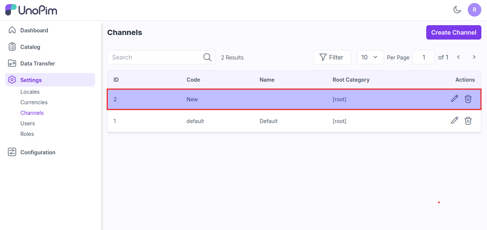

# Channels 

UnoPim allows you to set up and manage multiple instances of domains or stores in a single UnoPim backend. This guide will walk you through how to create multiple websites with different domains in UnoPim.

### Creating Channels in UnoPim.

**Step 1:** The UnoPim's channel functionality allows creating multiple websites in UnoPim. Here you need to proceed towards **Settings >> Channels >> Create Channel** as shown in below image.

  

### General

Below are the fields that fall under the General section.

**1.Code:** Provide a code for your channel.

**2.Root Category:** Select your root category from the dropdown.

**3.Name Translaion:** Enter the translations of your channel as per your Locales.

**4. Locales & Currencies :** Enter your locale & currencies for your channels.

  

At last, **Save the Channel**.

  

By this you can easily create a Channels in UnoPim