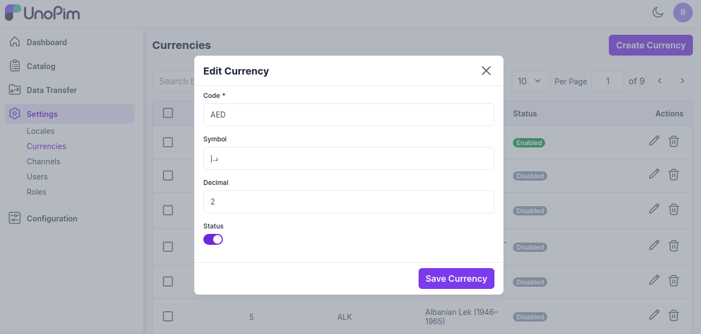
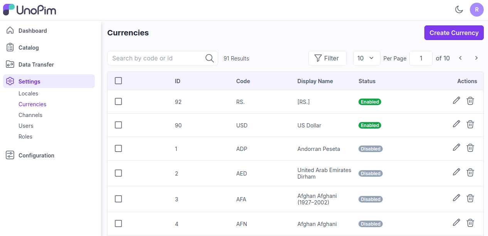

# Currencies

Before launching your eCommerce website you need to set up the currency in which you will doing your business. Currency symbol will be visible in product prices, order, invoices, transactions etc. Here we have mentioned steps on how to add currency in UnoPim.

### Add Currency in UnoPim

**Step 1:** On the Admin panel of UnoPim go to **Setting >> Currencies >> Create Currency** as shown in below image.

  

**Step 2:** Now Enter **Code, Name, Symbol, Decimal** then enable the **Status** and click on **Save Currency** button as shown in below image.

  

**Step 3:** Now you will able to see the new **Currency** by the name of **Rupees** as shown below.

  

**Step 4:** On the admin panel open **Settings >> Channels** you will able to see Currency section and your new currency right there.

Once the channel setting has been done click on **Save Channel** as shown in below image.

  

So by this you can easily create a **Currency** in UnoPim.   

