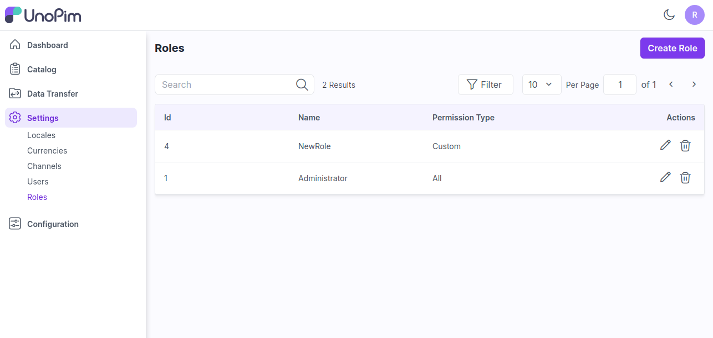

# Roles

Roles in unopim allow the store owner to create the user and provide roles for every user. Here will discuss how to create admin ACL in UnoPim.

### Create Roles

**Step 1:** It can be set on the admin panel by going to **Setting >> Roles**. Here you can create new role by clicking on the button **Create Role** as shown in below image.

  

**Step 2:** Add the below fields.

**1) Permissions:** Select the permission from the options **Custom & All**.

* **Custom-** Select the custom option if you need to show the menus as per your requiremnts for a user. 

* **All-** Select the all option if you need to show all the menus for a user.

2) **Name:** Enter the name of the role.

3) **Description:** Enter the description of the role.

  

**Step 3:** Now click on **Save Role** and a new role is created successfully in the Roles datagrid.

  

**Step 4:** Now you can assign this new role while creating a user go to **Settings >> Users** as shown in the image below.

  

**Step 5:** Now login with your new user and check the new user with the assign custom permissions as shown in the image below.  

  

By this you can easily create a Roles in UnoPim

