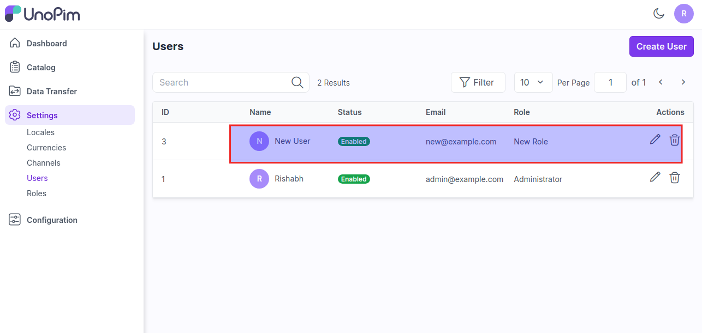

# Users

It refer to the individuals who interact with the system, including roles such as product managers, content creators, marketers, and administrators, each with specific permissions and access levels for managing and maintaining product data.

### Steps to create Users in UnoPim

**Step 1:** It can be set on the admin panel by going to **Setting >> Users**. Here you can create new users by clicking on the button **Create User** as shown in below image.

**Step 2:** Now add the below fields 

1) **Name -** Enter the name of the User.

2) **Email -** Enter the Email of the User.

3) **Password -** Enter the password of the user.

4) **UI Locale -** Select your locale in which you need to show your new user.

5) **Timezone -** Select the timezone as per the user.

6) **Role -** Select the role of the user.

7) **Status -** Enable the status of the user.

8) **Image -** You can also add the image of the user.

At Last, click on **Save User** button.

  

**Step 3:** Now a new user is created successfully in the user datagrid as shown in the below image.

  

So by this you can easily create a Users in UnoPim.