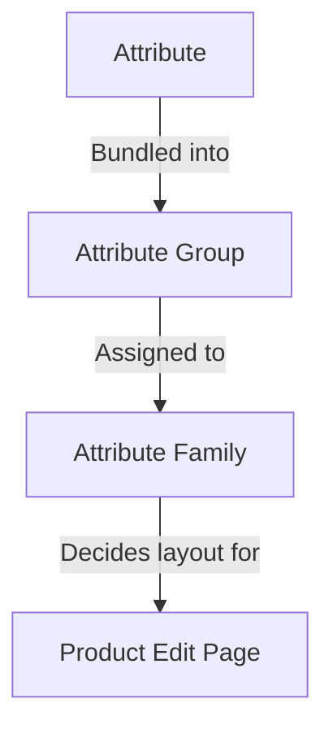

# Attribute

Ein **Attribut** ist ein einzelnes Merkmal eines Produkts — *Color*, *Size*, *Brand*, *Price*, *SKU*, *Description*, *Stock*. Die Gesamtheit der einem Produkt zugewiesenen Attribute verleiht diesem Produkt seine Form: welche Felder auf seiner Bearbeitungsseite erscheinen, welche Werte das Storefront anzeigen kann, welche Regeln die Daten validieren.

Das Attributsystem von UnoPim hat drei Bausteine, die zusammenpassen:

Die Zuweisung eines Produkts zu einer Familie wählt seine bearbeitbaren Felder aus; Gruppen steuern, wie diese Felder auf der Seite angeordnet sind; Attribute tragen die tatsächlichen Werte.

Die Zuweisung eines Produkts zu einer Familie wählt seine bearbeitbaren Felder aus; Gruppen steuern, wie diese Felder auf der Seite angeordnet sind; Attribute tragen die tatsächlichen Werte.

## Was in diesem Abschnitt enthalten ist

| Seite | Was sie behandelt |
|---|---|
| **[Attribut-Eingabetyp](./attribute-input.md)** | Die 12 Datentypen, die ein Attribut tragen kann (Text, Textarea, Boolean, Select, Multiselect, Datetime, Date, Image, Gallery, File, Checkbox, Price) sowie die in v2.0 eingeführten **Swatch-Typen** (Color / Image / Text). |
| **[Produktattribut](./product-attribute.md)** | Wie man ein Attribut von Anfang bis Ende erstellt — allgemeine Felder, Label-Übersetzungen, Validierungen, Konfiguration (Value Per Locale / Value Per Channel / Is Filterable) sowie die 12 Datentyp-Eingaben in Aktion. |
| **[Attributfamilie](./attribute-family.md)** | Wie man eine Familie erstellt und Attribute in ihre Gruppen zieht, damit Produkte in dieser Familie die richtigen Felder anzeigen. |
| **[Attributgruppen](./attribute-groups.md)** | Wie man Attribute in einer Gruppe bündelt, damit sie zusammen in einer eigenen Karte auf der Produktbearbeitungsseite gerendert werden. |

## Schlüsselkonzepte auf einen Blick

- **Jedes Attribut hat einen Datentyp** — siehe [Attribut-Eingabetyp](./attribute-input.md). Der Datentyp bestimmt das Eingabesteuerelement und die zulässigen Werte.
- **Jedes Attribut gehört zu einer Gruppe** — Gruppen sind rein organisatorisch, aber sie steuern das Layout der Produktbearbeitungsseite. Siehe [Attributgruppen](./attribute-groups.md).
- **Jedes Produkt gehört zu einer Familie** — die Familie entscheidet, welche Gruppen (und damit welche Attribute) auf diesem Produkt erscheinen. Siehe [Attributfamilie](./attribute-family.md).
- **Attribute können nach Locale, nach Kanal oder beidem variieren.** Konfigurieren Sie dies unter der Konfigurations-Karte beim Erstellen eines Attributs. Auf diese Weise speichern Sie eine separate Beschreibung pro Sprache oder einen separaten Preis pro Storefront.
- **Als `Is Filterable` markierte Attribute** erscheinen im **Apply Filters**-Drawer auf der Produktauflistung, sodass Ihr Team Produkte nach den Werten dieses Attributs filtern kann.

## v2.0-Highlights

- **Swatch-Typen** — Select- und Multiselect-Attribute können als visuelle Swatches (Color, Image oder Text) anstelle einfacher Dropdowns gerendert werden.
- **Video-Unterstützung** im Gallery-Attribut — Videodateien neben Bildern hochladen und verwalten.
- **Pro-Attribut-Filterung** — schalten Sie **Is Filterable** auf einem Attribut um, und es erscheint sofort im **Add Filter**-Drawer der Produktauflistung, ohne dass eine Neuindexierung erforderlich ist.

Springen Sie zu einer Unterseite oben, um die Schritt-für-Schritt-Anleitung für jede zu sehen.
