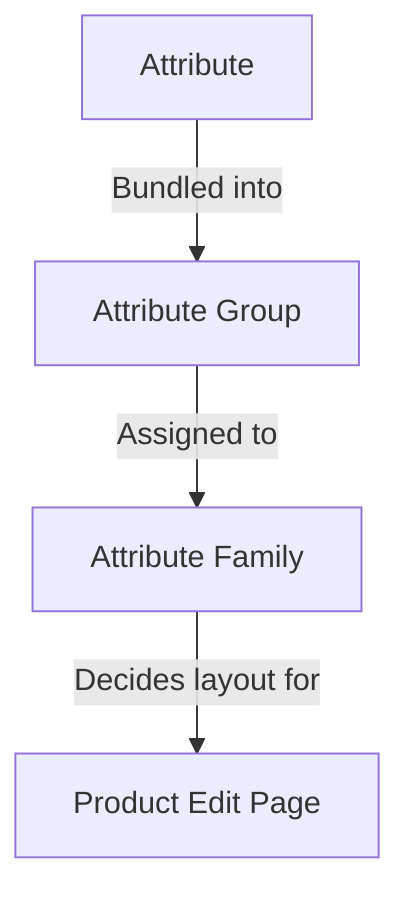

# Atributos

Un **atributo** es una única característica de un producto — *Color*, *Talla*, *Marca*, *Precio*, *SKU*, *Descripción*, *Stock*. El conjunto completo de atributos asignados a un producto es lo que le da su forma: qué campos aparecen en su página de edición, qué valores puede mostrar la tienda, qué reglas validan los datos.

El sistema de atributos de UnoPim tiene tres bloques de construcción que encajan entre sí:

Asignar un producto a una familia elige sus campos editables; los grupos controlan cómo esos campos se disponen en la página; los atributos llevan los valores reales.

Asignar un producto a una familia elige sus campos editables; los grupos controlan cómo esos campos se disponen en la página; los atributos llevan los valores reales.

## Qué hay en esta sección

| Página | Qué cubre |
|---|---|
| **[Tipo de Entrada de Atributo](./attribute-input.md)** | Los 12 tipos de datos que un atributo puede llevar (Text, Textarea, Boolean, Select, Multiselect, Datetime, Date, Image, Gallery, File, Checkbox, Price) más los **Swatch Types** (Color / Image / Text) introducidos en v2.0. |
| **[Atributo de Producto](./product-attribute.md)** | Cómo crear un atributo de principio a fin — campos generales, traducciones de etiquetas, validaciones, configuración (Value Per Locale / Value Per Channel / Is Filterable), además de los 12 tipos de datos en acción. |
| **[Familia de atributos](./attribute-family.md)** | Cómo crear una familia y arrastrar atributos en sus grupos para que los productos en esa familia muestren los campos correctos. |
| **[Grupo de atributos](./attribute-groups.md)** | Cómo agrupar atributos en un grupo para que se rendericen juntos en una tarjeta dedicada en la página de edición del producto. |

## Conceptos clave de un vistazo

- **Cada atributo tiene un tipo de datos** — consulte [Tipo de Entrada de Atributo](./attribute-input.md). El tipo de datos determina el control de entrada y los valores permitidos.
- **Cada atributo pertenece a un grupo** — los grupos son puramente organizativos, pero impulsan la disposición de la página de edición del producto. Consulte [Grupo de atributos](./attribute-groups.md).
- **Cada producto pertenece a una familia** — la familia decide qué grupos (y por tanto qué atributos) aparecen en ese producto. Consulte [Familia de atributos](./attribute-family.md).
- **Los atributos pueden variar por locale, por canal o ambos.** Configure esto en la tarjeta Configuration al crear un atributo. Así es como almacena una Descripción separada por idioma, o un Precio separado por tienda.
- **Los atributos marcados como `Is Filterable`** aparecen en el cajón **Apply Filters** en el listado de Productos, para que su equipo pueda filtrar productos por los valores de ese atributo.

## Aspectos destacados de v2.0

- **Swatch Types** — Los atributos Select y Multiselect pueden renderizarse como muestras visuales (Color, Image o Text) en lugar de desplegables planos.
- **Soporte de Vídeo** en el atributo Gallery — suba y gestione archivos de vídeo junto con imágenes.
- **Filtrado por atributo** — alterne **Is Filterable** en un atributo y aparece inmediatamente en el cajón **Add Filter** del listado de Productos, sin necesidad de reindexar.

Salte a una subpágina arriba para ver la guía paso a paso de cada una.
