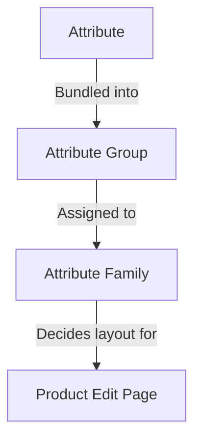

# Attributs

Un **attribut** est une caractéristique unique d'un produit — *Color*, *Size*, *Brand*, *Price*, *SKU*, *Description*, *Stock*. L'ensemble complet des attributs affectés à un produit est ce qui donne à ce produit sa forme : quels champs apparaissent sur sa page d'édition, quelles valeurs la vitrine peut afficher, quelles règles valident les données.

Le système d'attributs d'UnoPim a trois blocs de construction qui s'assemblent :

Affecter un produit à une famille sélectionne ses champs éditables ; les groupes contrôlent la manière dont ces champs sont disposés sur la page ; les attributs portent les valeurs réelles.

Affecter un produit à une famille sélectionne ses champs éditables ; les groupes contrôlent la manière dont ces champs sont disposés sur la page ; les attributs portent les valeurs réelles.

## Ce qui se trouve dans cette section

| Page | Ce qu'elle couvre |
|---|---|
| **[Type de saisie d'attribut](./attribute-input.md)** | Les 12 types de données qu'un attribut peut porter (Text, Textarea, Boolean, Select, Multiselect, Datetime, Date, Image, Gallery, File, Checkbox, Price) plus les **Swatch Types** (Color / Image / Text) introduits en v2.0. |
| **[Attribut produit](./product-attribute.md)** | Comment créer un attribut de bout en bout — champs généraux, traductions de labels, validations, configuration (Value Per Locale / Value Per Channel / Is Filterable), plus les 12 saisies de type de données illustrées en action. |
| **[Famille d'attributs](./attribute-family.md)** | Comment créer une famille et glisser des attributs dans ses groupes pour que les produits de cette famille affichent les bons champs. |
| **[Groupes d'attributs](./attribute-groups.md)** | Comment regrouper des attributs dans un groupe afin qu'ils s'affichent ensemble dans une carte dédiée sur la page d'édition du produit. |

## Concepts clés en un coup d'œil

- **Chaque attribut a un type de données** — voir [Type de saisie d'attribut](./attribute-input.md). Le type de données détermine le contrôle de saisie et les valeurs autorisées.
- **Chaque attribut appartient à un groupe** — les groupes sont purement organisationnels, mais ils déterminent la mise en page de la page d'édition du produit. Voir [Groupes d'attributs](./attribute-groups.md).
- **Chaque produit appartient à une famille** — la famille décide quels groupes (et donc quels attributs) apparaissent sur ce produit. Voir [Famille d'attributs](./attribute-family.md).
- **Les attributs peuvent varier par locale, par canal ou les deux.** Configurez ceci sous la carte Configuration lors de la création d'un attribut. C'est ainsi que vous stockez une Description distincte par langue, ou un Prix distinct par vitrine.
- **Les attributs marqués `Is Filterable`** apparaissent dans le tiroir **Apply Filters** sur la liste des produits, afin que votre équipe puisse filtrer les produits par les valeurs de cet attribut.

## Points forts de la v2.0

- **Swatch Types** — Les attributs Select et Multiselect peuvent être rendus sous forme de pastilles visuelles (Color, Image ou Text) au lieu de simples listes déroulantes.
- **Prise en charge vidéo** dans l'attribut Gallery — téléversez et gérez des fichiers vidéo aux côtés des images.
- **Filtrage par attribut** — activez **Is Filterable** sur un attribut et il apparaît immédiatement dans le tiroir **Add Filter** de la liste des produits, sans aucune réindexation nécessaire.

Sautez vers une sous-page ci-dessus pour voir le guide étape par étape pour chacune.
