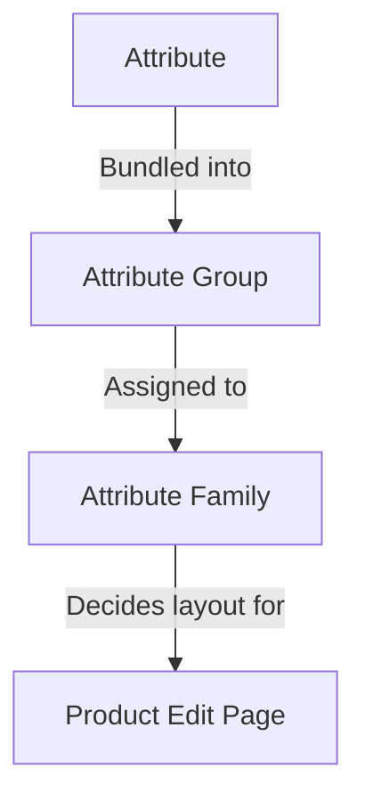

# Attributen

Een **attribuut** is één kenmerk van een product — *Color*, *Size*, *Brand*, *Price*, *SKU*, *Description*, *Stock*. De volledige set van attributen die aan een product is toegewezen, is wat dat product zijn vorm geeft: welke velden verschijnen op zijn edit-pagina, welke waarden de storefront kan weergeven, welke regels de gegevens valideren.

Het attribuut-systeem van UnoPim heeft drie bouwstenen die in elkaar passen:

Het toewijzen van een product aan een family kiest zijn bewerkbare velden; groepen bepalen hoe die velden op de pagina worden gerangschikt; attributen dragen de daadwerkelijke waarden.

Het toewijzen van een product aan een family kiest zijn bewerkbare velden; groepen bepalen hoe die velden op de pagina worden gerangschikt; attributen dragen de daadwerkelijke waarden.

## Wat staat er in deze sectie

| Pagina | Wat het behandelt |
|---|---|
| **[Attribute Input Type](./attribute-input.md)** | De 12 datatypen die een attribuut kan dragen (Text, Textarea, Boolean, Select, Multiselect, Datetime, Date, Image, Gallery, File, Checkbox, Price) plus de **Swatch Types** (Color / Image / Text) geïntroduceerd in v2.0. |
| **[Product Attribute](./product-attribute.md)** | Hoe u end-to-end een attribuut aanmaakt — algemene velden, labelvertalingen, validaties, configuratie (Value Per Locale / Value Per Channel / Is Filterable), plus de 12 datatype-invoertypen in actie getoond. |
| **[Attribuutset](./attribute-family.md)** | Hoe u een set aanmaakt en attributen in zijn groepen sleept zodat producten in die set de juiste velden tonen. |
| **[Attribuutgroepen](./attribute-groups.md)** | Hoe u attributen bundelt in een groep zodat ze samen renderen in een speciale kaart op de productbewerk-pagina. |

## Belangrijke concepten in één oogopslag

- **Elk attribuut heeft een datatype** — zie [Attribute Input Type](./attribute-input.md). Het datatype bepaalt de invoerbesturing en de toegestane waarden.
- **Elk attribuut behoort tot een groep** — groepen zijn puur organisatorisch, maar ze bepalen de lay-out van de productbewerk-pagina. Zie [Attribuutgroepen](./attribute-groups.md).
- **Elk product behoort tot een set** — de set bepaalt welke groepen (en dus welke attributen) op dat product verschijnen. Zie [Attribuutset](./attribute-family.md).
- **Attributen kunnen variëren per locale, per channel of beide.** Configureer dit onder de Configuration-kaart bij het aanmaken van een attribuut. Zo bewaart u een aparte Description per taal, of een aparte Price per storefront.
- **Attributen die zijn gemarkeerd als `Is Filterable`** verschijnen in de drawer **Apply Filters** in de Products-lijst, zodat uw team producten kan filteren op de waarden van dat attribuut.

## v2.0 hoogtepunten

- **Swatch Types** — Select- en Multiselect-attributen kunnen worden gerenderd als visuele swatches (Color, Image of Text) in plaats van gewone dropdowns.
- **Video-ondersteuning** in het Gallery-attribuut — upload en beheer videobestanden naast afbeeldingen.
- **Per-attribuut-filtering** — schakel **Is Filterable** in op een attribuut en het verschijnt direct in de **Add Filter**-drawer van de Products-lijst, geen reindex nodig.

Spring naar een subpagina hierboven om de stapsgewijze handleiding voor elk te zien.
