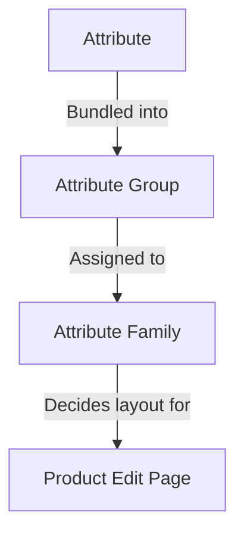

# Atrybuty

**Atrybut** to pojedyncza cecha produktu — *Color*, *Size*, *Brand*, *Price*, *SKU*, *Description*, *Stock*. Pełny zestaw atrybutów przypisanych do produktu nadaje mu kształt: które pola pojawiają się na stronie edycji, które wartości może wyświetlić sklep internetowy, które reguły walidują dane.

System atrybutów UnoPim ma trzy elementy budulcowe, które pasują do siebie:

Przypisanie produktu do rodziny wybiera jego edytowalne pola; grupy kontrolują, jak te pola są rozmieszczone na stronie; atrybuty przenoszą rzeczywiste wartości.

Przypisanie produktu do rodziny wybiera jego edytowalne pola; grupy kontrolują, jak te pola są rozmieszczone na stronie; atrybuty przenoszą rzeczywiste wartości.

## Co znajduje się w tej sekcji

| Strona | Co obejmuje |
|---|---|
| **[Attribute Input Type](./attribute-input.md)** | 12 typów danych, które może przenosić atrybut (Text, Textarea, Boolean, Select, Multiselect, Datetime, Date, Image, Gallery, File, Checkbox, Price) plus **Swatch Types** (Color / Image / Text) wprowadzone w v2.0. |
| **[Product Attribute](./product-attribute.md)** | Jak utworzyć atrybut od początku do końca — pola ogólne, tłumaczenia etykiet, walidacje, konfiguracja (Value Per Locale / Value Per Channel / Is Filterable), plus 12 wejść typu danych pokazanych w działaniu. |
| **[Attribute Family](./attribute-family.md)** | Jak utworzyć rodzinę i przeciągnąć atrybuty do jej grup, aby produkty w tej rodzinie pokazywały odpowiednie pola. |
| **[Attribute Groups](./attribute-groups.md)** | Jak połączyć atrybuty w grupę, aby renderowały się razem w dedykowanej karcie na stronie edycji produktu. |

## Kluczowe koncepcje w pigułce

- **Każdy atrybut ma typ danych** — zobacz [Attribute Input Type](./attribute-input.md). Typ danych określa kontrolkę wejścia i dozwolone wartości.
- **Każdy atrybut należy do grupy** — grupy są wyłącznie organizacyjne, ale napędzają układ strony edycji produktu. Zobacz [Attribute Groups](./attribute-groups.md).
- **Każdy produkt należy do rodziny** — rodzina decyduje, które grupy (a zatem które atrybuty) pojawiają się na tym produkcie. Zobacz [Attribute Family](./attribute-family.md).
- **Atrybuty mogą różnić się w zależności od lokalizacji, kanału lub obu naraz.** Skonfiguruj to w karcie Configuration podczas tworzenia atrybutu. W ten sposób przechowujesz osobny Description per język lub osobną Cenę per sklep.
- **Atrybuty oznaczone `Is Filterable`** pojawiają się w szufladzie **Apply Filters** na liście produktów, dzięki czemu Twój zespół może filtrować produkty według wartości tego atrybutu.

## Najważniejsze cechy v2.0

- **Swatch Types** — Atrybuty Select i Multiselect mogą renderować się jako wizualne swatche (Color, Image lub Text) zamiast zwykłych rozwijanych list.
- **Obsługa wideo** w atrybucie Gallery — przesyłaj i zarządzaj plikami wideo obok obrazów.
- **Filtrowanie per atrybut** — przełącz **Is Filterable** na atrybucie, a natychmiast pojawi się w szufladzie **Add Filter** na liście produktów, bez potrzeby reindeksowania.

Przejdź do podstrony powyżej, aby zobaczyć przewodnik krok po kroku dla każdego.
